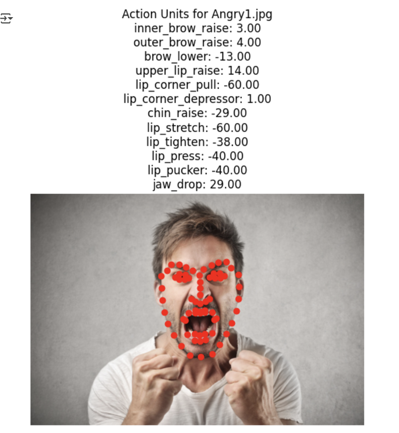
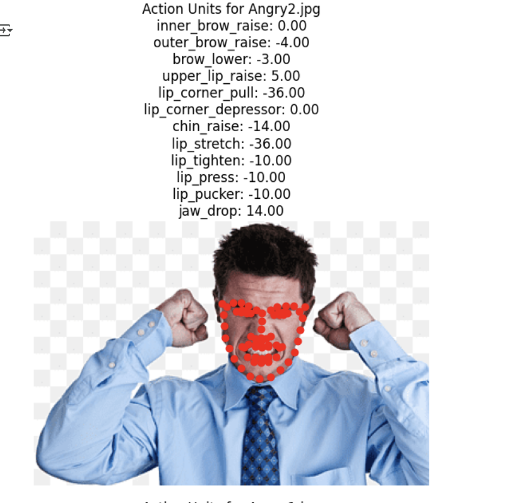
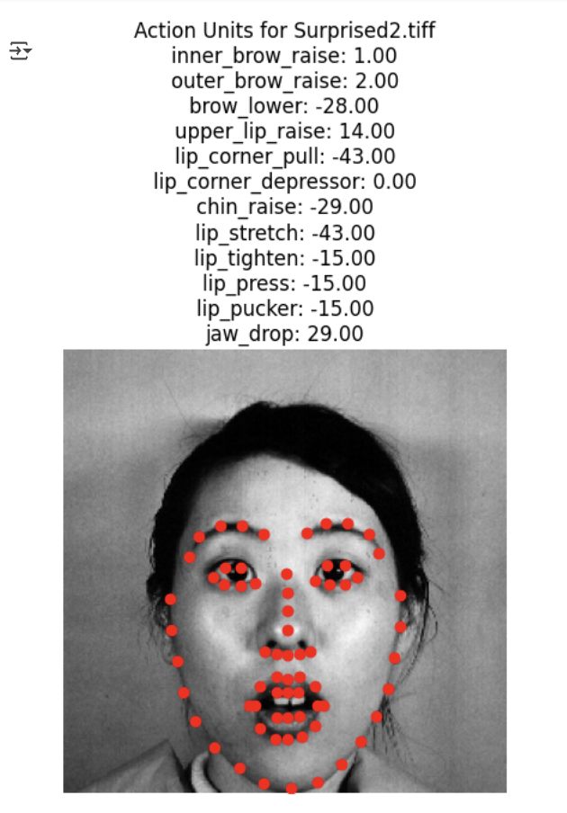

# Feature-extraction-preprocessing-pipeline

# Facial Landmark & Action Unit Extraction

This project uses **dlib** and **OpenCV** to detect facial landmarks and compute **Action Units (AUs)** from images.  
It extracts features such as brow raise, lip movement, and jaw drop, then saves the results into a CSV file for further analysis or emotion recognition tasks.

## Example Outputs

### Angry Expression 1

### Angry Expression 

### Surprised Expression

## Features
- Face detection with dlib
- 68 facial landmark extraction
- Action Unit calculation (AU1, AU2, AU4, AU10, AU12, AU15, AU17, AU20, AU23, AU24, AU26, AU28)
- Visualization of landmarks
- CSV export of AU features
